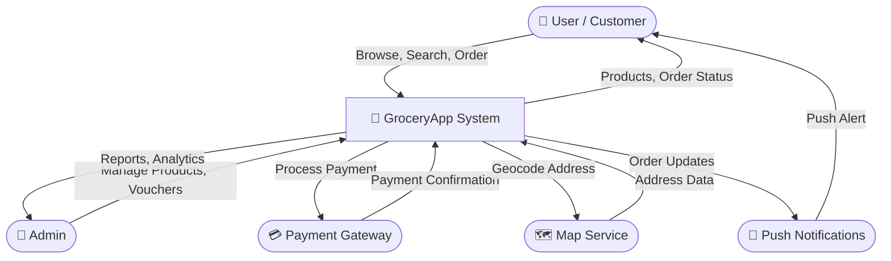
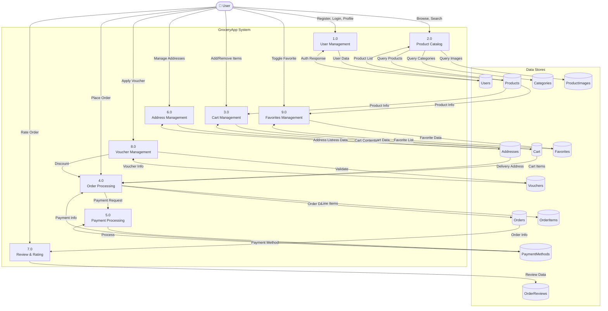
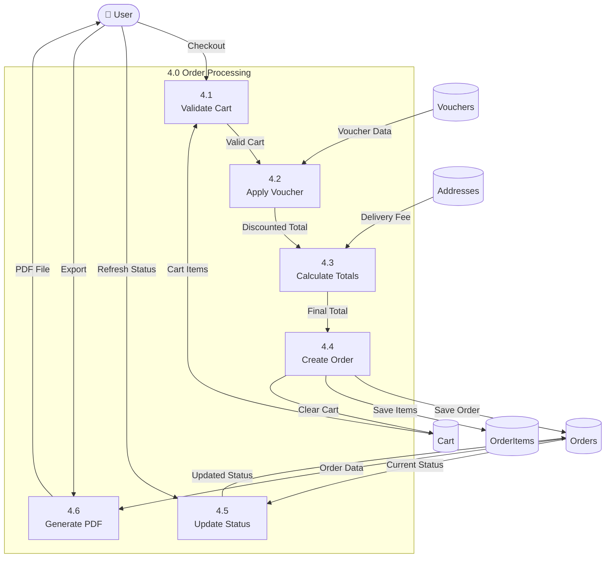
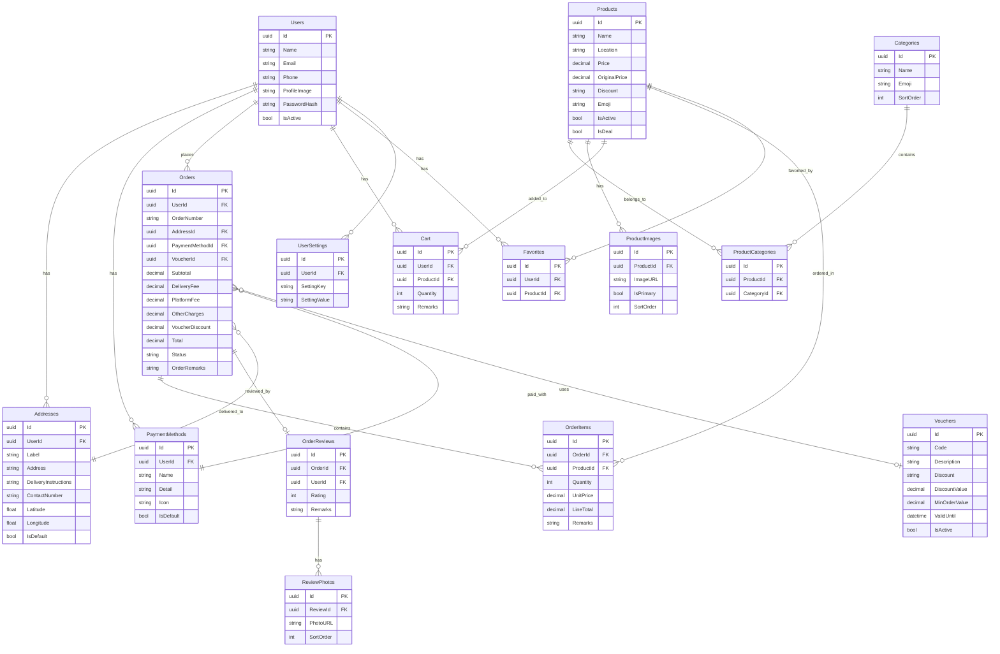

# GroceryApp - Data Flow Diagram

## Level 0 - Context Diagram

```mermaid
flowchart TB
    User([👤 User / Customer])
    Admin([🔧 Admin])
    System[🛒 GroceryApp System]
    Payment([💳 Payment Gateway])
    Maps([🗺️ Map Service])
    Notif([🔔 Push Notifications])

    User -->|Browse, Search, Order| System
    System -->|Products, Order Status| User
    Admin -->|Manage Products, Vouchers| System
    System -->|Reports, Analytics| Admin
    System -->|Process Payment| Payment
    Payment -->|Payment Confirmation| System
    System -->|Geocode Address| Maps
    Maps -->|Address Data| System
    System -->|Order Updates| Notif
    Notif -->|Push Alert| User
```

## Level 1 - Main Processes

```mermaid
flowchart TB
    User([👤 User])

    subgraph GroceryApp System
        P1[1.0<br/>User Management]
        P2[2.0<br/>Product Catalog]
        P3[3.0<br/>Cart Management]
        P4[4.0<br/>Order Processing]
        P5[5.0<br/>Payment Processing]
        P6[6.0<br/>Address Management]
        P7[7.0<br/>Review & Rating]
        P8[8.0<br/>Voucher Management]
        P9[9.0<br/>Favorites Management]
    end

    subgraph Data Stores
        D1[(Users)]
        D2[(Products)]
        D3[(Categories)]
        D4[(Cart)]
        D5[(Orders)]
        D6[(OrderItems)]
        D7[(Addresses)]
        D8[(PaymentMethods)]
        D9[(Vouchers)]
        D10[(Favorites)]
        D11[(OrderReviews)]
        D12[(ProductImages)]
    end

    User -->|Register, Login, Profile| P1
    P1 -->|User Data| D1
    D1 -->|Auth Response| P1

    User -->|Browse, Search| P2
    P2 -->|Query Products| D2
    P2 -->|Query Categories| D3
    P2 -->|Query Images| D12
    D2 -->|Product List| P2

    User -->|Add/Remove Items| P3
    P3 -->|Cart Data| D4
    D4 -->|Cart Contents| P3
    D2 -->|Product Info| P3

    User -->|Place Order| P4
    P4 -->|Order Data| D5
    P4 -->|Line Items| D6
    D4 -->|Cart Items| P4
    D7 -->|Delivery Address| P4
    D8 -->|Payment Info| P4

    P4 -->|Payment Request| P5
    P5 -->|Process| D8
    D8 -->|Payment Method| P5

    User -->|Manage Addresses| P6
    P6 -->|Address Data| D7
    D7 -->|Address List| P6

    User -->|Rate Order| P7
    P7 -->|Review Data| D11
    D5 -->|Order Info| P7

    User -->|Apply Voucher| P8
    P8 -->|Validate| D9
    D9 -->|Voucher Info| P8
    P8 -->|Discount| P4

    User -->|Toggle Favorite| P9
    P9 -->|Favorite Data| D10
    D10 -->|Favorite List| P9
    D2 -->|Product Info| P9
```

## Level 2 - Order Processing Detail

```mermaid
flowchart TB
    User([👤 User])

    subgraph 4.0 Order Processing
        P4_1[4.1<br/>Validate Cart]
        P4_2[4.2<br/>Apply Voucher]
        P4_3[4.3<br/>Calculate Totals]
        P4_4[4.4<br/>Create Order]
        P4_5[4.5<br/>Update Status]
        P4_6[4.6<br/>Generate PDF]
    end

    D4[(Cart)]
    D5[(Orders)]
    D6[(OrderItems)]
    D7[(Addresses)]
    D9[(Vouchers)]

    User -->|Checkout| P4_1
    D4 -->|Cart Items| P4_1
    P4_1 -->|Valid Cart| P4_2
    D9 -->|Voucher Data| P4_2
    P4_2 -->|Discounted Total| P4_3
    D7 -->|Delivery Fee| P4_3
    P4_3 -->|Final Total| P4_4
    P4_4 -->|Save Order| D5
    P4_4 -->|Save Items| D6
    P4_4 -->|Clear Cart| D4
    User -->|Refresh Status| P4_5
    D5 -->|Current Status| P4_5
    P4_5 -->|Updated Status| D5
    User -->|Export| P4_6
    D5 -->|Order Data| P4_6
    P4_6 -->|PDF File| User
```

## Entity Relationship Diagram

```mermaid
erDiagram
    Users ||--o{ Addresses : has
    Users ||--o{ PaymentMethods : has
    Users ||--o{ Orders : places
    Users ||--o{ Cart : has
    Users ||--o{ Favorites : has
    Users ||--o{ UserSettings : has

    Products ||--o{ ProductCategories : belongs_to
    Categories ||--o{ ProductCategories : contains
    Products ||--o{ ProductImages : has
    Products ||--o{ Cart : added_to
    Products ||--o{ OrderItems : ordered_in
    Products ||--o{ Favorites : favorited_by

    Orders ||--o{ OrderItems : contains
    Orders ||--o| OrderReviews : reviewed_by
    Orders }o--|| Addresses : delivered_to
    Orders }o--|| PaymentMethods : paid_with
    Orders }o--o| Vouchers : uses

    OrderReviews ||--o{ ReviewPhotos : has

    Users {
        uuid Id PK
        string Name
        string Email
        string Phone
        string ProfileImage
        string PasswordHash
        bool IsActive
    }

    Products {
        uuid Id PK
        string Name
        string Location
        decimal Price
        decimal OriginalPrice
        string Discount
        string Emoji
        bool IsActive
        bool IsDeal
    }

    Categories {
        uuid Id PK
        string Name
        string Emoji
        int SortOrder
    }

    Orders {
        uuid Id PK
        uuid UserId FK
        string OrderNumber
        uuid AddressId FK
        uuid PaymentMethodId FK
        uuid VoucherId FK
        decimal Subtotal
        decimal DeliveryFee
        decimal PlatformFee
        decimal OtherCharges
        decimal VoucherDiscount
        decimal Total
        string Status
        string OrderRemarks
    }

    OrderItems {
        uuid Id PK
        uuid OrderId FK
        uuid ProductId FK
        int Quantity
        decimal UnitPrice
        decimal LineTotal
        string Remarks
    }

    Addresses {
        uuid Id PK
        uuid UserId FK
        string Label
        string Address
        string DeliveryInstructions
        string ContactNumber
        float Latitude
        float Longitude
        bool IsDefault
    }

    PaymentMethods {
        uuid Id PK
        uuid UserId FK
        string Name
        string Detail
        string Icon
        bool IsDefault
    }

    Vouchers {
        uuid Id PK
        string Code
        string Description
        string Discount
        decimal DiscountValue
        decimal MinOrderValue
        datetime ValidUntil
        bool IsActive
    }

    Cart {
        uuid Id PK
        uuid UserId FK
        uuid ProductId FK
        int Quantity
        string Remarks
    }

    Favorites {
        uuid Id PK
        uuid UserId FK
        uuid ProductId FK
    }

    OrderReviews {
        uuid Id PK
        uuid OrderId FK
        uuid UserId FK
        int Rating
        string Remarks
    }

    ReviewPhotos {
        uuid Id PK
        uuid ReviewId FK
        string PhotoURL
        int SortOrder
    }

    ProductImages {
        uuid Id PK
        uuid ProductId FK
        string ImageURL
        bool IsPrimary
        int SortOrder
    }

    ProductCategories {
        uuid Id PK
        uuid ProductId FK
        uuid CategoryId FK
    }

    UserSettings {
        uuid Id PK
        uuid UserId FK
        string SettingKey
        string SettingValue
    }
```
